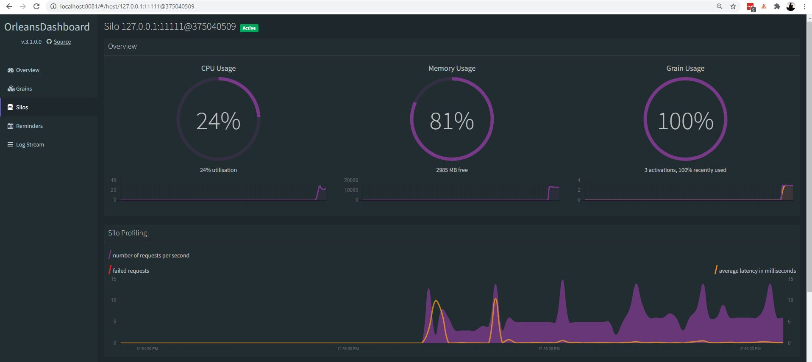
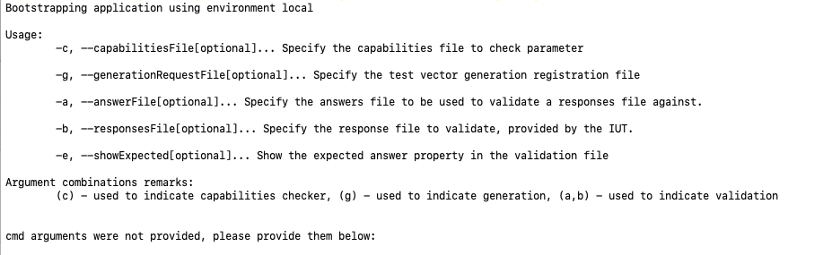

# Automated Cryptographic Validation Test System - Gen/Vals

This project contains the code used by the National Institute of Standards and Technology (NIST) Cryptographic Algorithm Validation Program (CAVP) to generate and validate test vectors for Federal Information Processing Standard (FIPS) 140.

## Jump to

* [ACVP-Server](#acvp-server)
* [Releases](#releases)
* [Wiki](#wiki)
* [Issues](#issues)
* [Project Structure](#project-structure)
* [Repository Overview](#repository-overview)
* [Setting Up](#setting-up)
    * [Sym Links](#sym-links)
* [Running](#running)
    * [Gen/Vals](#genvals)
    * [Orleans Server](#orleans-server)
* [Testing](#testing)
* [License](#license)
* [Contributions](#contributions)
* [Contact](#contact)

## ACVP-Server

An implementation of the [Automated Cryptographic Validation Protocol (ACVP)](https://github.com/usnistgov/acvp) for NIST. This repository will be used to track deployments and issues of the Demo and Production ACVP Servers hosted by NIST. The server implementation *MAY* differ from the protocol specification. We will track those differences in this repository. Some modifications may be additional requirements on top of the protocol that are NIST specific. The protocol is intended to be general purpose for any testing body to host a compliant instance. 

## Releases

Release notes will often be posted on this repository for both the Demo and Production NIST ACVP servers. Release notes marked as "prerelease" are for the Demo server. Notes marked as "release" are for the Prod server. 

## Wiki

* See the [ACVP-Server Wiki](https://github.com/usnistgov/ACVP-Server/wiki) for information such as documentation on ACVP Server specific endpoints.
* See the [ACVP Protocol Wiki](https://github.com/usnistgov/ACVP/wiki) for information regarding protocol specific usage / FAQs.

## Issues

Please report issues found on the Demo or Prod servers on this repository. Issues that can be reported here include

* Errors generating or validating vector sets
* Questions about the server/implementation
* Questions about authentication
* Noticed differences from the protocol specifications
* Suggestions for improved tests

Questions or problems with the specifications, can be raised with issues on the protocol repository. Questions or problems with the CAVP's use of ACVP or how ACVP fits into the larger CMVP should be raised via email to a member of the CAVP. 

When creating an issue, DO NOT share any secret values used for authentication. DO NOT share a JWT, and DO NOT share a TOTP seed. 

## Project Structure

ACVTS can be separated out into two larger components. Server structure and Gen/Vals. The server structure includes serveral projects to host the API and maintain workflows for ACVTS. The Gen/Vals includes several projects that focus on generating tests and verifying the correctness of responses. The code in this repository is only for the Gen/Vals. With this code, any one can produce vector sets for algorithms on demand without needing to contact the ACVTS API. 

The Gen/Vals can be further broken out into several areas: the Crypto code, Generation code, and an [Orleans](https://github.com/dotnet/orleans) server. There are also test projects for each of these components. Here is a complete list of sections:

* [Sample Executables](#samples)
    * [GenValAppRunner](#genvalapprunner)
    * [Orleans.ServerHost](#orleans-serverhost)
* [src](#src)
    * [Common](#common)
    * [Generation](#generation)
    * [Crypto](#crypto)
    * [Orleans](#orleans)
    * [Solutions](#solutions)

Many of the above sections could likely be further broken down into more granular sections, like abstraction vs implementation, and testing, but these are the high level concepts of the system.

### Sample Executables

The `samples/` folder contains the [GenValAppRunner](#genvalapprunner) and [Orleans.ServerHost](#orleans-serverhost) runnable applications - the only two portions of the repository you'll need to be concerned with if your intention is to just run the generation and validation processes against an algorithm registration.

The two applications in the samples folder are "wrapper" applications into the logic and abstractions of the program as a whole.

#### GenValAppRunner

The GenValAppRunner is a console application that takes in parameters for its "running mode" - "check", "generation" or "validation". This application can be invoked with a `dotnet run` from the folder containing the applications `csproj` file.

See [Running Gen/Vals](#runningGenVals) for more information.

#### Orleans ServerHost

The Orleans.ServerHost application is the means of distributing CPU bound work across a cluster of nodes. For the purposes of the Orleans.ServerHost sample in this repository, the application is set up to use "local" clustering. Going this route allows for the running of the GenValAppRunner using no additional infrastructure, but also limiting the running of the application to a local, single node "cluster" of compute.

In a more "real world" situation, the Orleans.ServerHost application can be brought up as multiple instances, with a highly available clustering mechanism, to distribute compute (crypto calls) to all nodes within the Orleans cluster.

This application ***MUST*** be running in order for the GenValAppRunner to function, as all crypto calls are computed through Orleans.

More information on Orleans can be found here: https://github.com/dotnet/orleans.

The Orleans.ServerHost relies on configuration from the `sharedappsettings.json` file to inform the node how many piece of concurrent work can be done in parallel. Orleans relies on asynchronous communication between the client and server, so it is important that the amount of concurrent work specified through the `MaxConcurrentWork` property is *less* than the number of CPUs available to the machine. There always needs to be some compute available for the acknowledgement and responses between the client and node(s) in the cluster.

When running the system, if generation/validation fails, it could be because of the `MaxConcurrentWork` being set too high. One means of determining this, is by making use of the [Orleans.Dashboard](https://github.com/OrleansContrib/OrleansDashboard) which is set up to run (by default) on port 8081 alongside the Orleans server. 



If the CPU utilization on the dashboard is consistently above 95%, you may want to reduce the amount of concurrent work you're attempting to do, or bring up additional nodes for your Orleans cluster, while relying on a different clustering strategy than "local clustering". 

See [Running Orleans Server](#orleans-server) for more information.

### src

The primary "substance" (implementations/code) of the application is contained within the src folder and its sub-folders.

#### Common

Common functionality that can be used across other projects. This is the "root" of the object dependency graph that makes up the system as a whole. The project contains several extension methods, services, and enums that are used throughout other portions of the system. A core feature of ACVTS is the `BitString.cs` class contained within `~/gen-val/src/common/src/NIST.CVP.ACVTS.Libraries.Math`. The `NIST.CVP.ACVTS.Libraries.Math` project contains many data structures and utilities used to perform cryptographic operations. 

#### Generation

This section is used to define the abstraction of the flow through the generation and validation process. For each algorithm tested, a grouping of new "strategies" are implemented against pieces of that abstraction. The general flow of the generation process is as follows: 

1. Parse Parameters - The `registration.json` is parsed into `Parameters.cs` and checked for correctness via `ParameterValidator.cs`.
2. Generate Vector Set - This is filled with metadata about the algorithm, mode, and revision being tested. 
3. Generate Test Groups - A test group is a set of tests focused on specific properties within the algorithm. 
4. Generate Test Cases - A test case is an individual unit of work the client is expected to perform for the validation. 
5. Dispatch Crypto Tasks - Request the Orleans Server to provide content to the test cases defined. The actual content generation of the test cases happens in `~/gen-val/src/orleans/src/NIST.CVP.ACVTS.Libraries.Orleans.Grains/`.
6. Serialize Vector Set - With content the full vector set is serialized into several JSON files as defined by the `ContractResolvers`.

Some algorithms may not follow this process exactly. Some algorithms need crypto results during Test Group generation and may make such requests early. Some algorithms may utilize additional classes to distinguish between similar algorithms and reduce duplicated code (such as CMAC-AES and CMAC-TDES). 

The general flow of the validation process is as follows:

1. Deserialize InternalProjection and SubmittedResults - The JSON files must be converted back into the associated `TestVectorSet.cs`, `TestGroup.cs`, and `TestCase.cs` data models. 
2. Assign Validators - A `TestCaseValidator.cs` is created for each individual test case.
3. Dispatch Validators - All validators are executed and their results compiled.
4. Dispatch Crypto Tasks - Some algorithms may not allow the server to precompute results (i.e. when input from the client is provided in the `expectedResults.json`), the server computes the results during this step by dispatching jobs to Orleans. 
5. Serialize Validation File - The final `validation.json` file is produced. 

##### Generation.Core 

This assembly defines the interfaces and base classes that are required to provide strategy implementations for testing against an algorithm. In addition to the abstractions, there are implementation classes that walk through the yet-to-be provided strategies (through the `IGenValInvoker` or `GenValAppRunner`) in order to perform either generation or validation against a registration/vector set.

##### Generation

This assembly contains all of the "per algorithm" implementations of the interfaces defined from `Generation.Core`. For each algorithm tested, the generation/validation strategies can be found under `Generation`, organized under a folder or subfolder from the root of the project. Some algorithms from the protocol may call the same set of Gen/Val code.

#### Crypto

The crypto assemblies define the abstractions (`Crypto.Common`) as well as implementations (`Crypto`) of all the cryptography utilized and tested within the system. Generally, the cryptography is not directly invoked by the generation/validation process, but calls are rather pushed to the Orleans cluster; which allows for the distribution of the CPU bound work.

#### Orleans

The projects under Orleans defined both the abstractions and implementations of ["Grains"](https://dotnet.github.io/orleans/docs/grains/index.html). These grains are the piece of the system that actually perform the crypto work.

#### Solutions

The solutions that are included under `~/gen-val/src/solutions` are for each individual (or group of) algorithm(s) supported for generation/validation.

These solutions differ from opening the `GenValAppRunner` solution in that they contain test projects for the crypto/genvals specific to the algorithm. Since the crypto and genvals (integration) tests tend to be the longest running aspect of the test suite, they are not included as a part of the `GenValAppRunner` nor `Orleans.ServerHost` solutions.

There is also an `All.sln` that contains every project from the repository. **Caution** when running the tests on `All.sln`, this will take around 12 hours. 

### json-files

This folder contains sample JSON files from all algorithms covered by the Gen/Vals. Use these when you would like to quickly grab a full set of files for testing. This includes registration, prompt, internalProjection, and expectedResults. These files are generated by the `NIST.CVP.ACVTS.Libraries.Generation.<Algo>.IntegrationTests` project under `GenValTests.cs` via the `GetTestFileLotsOfTestCases()` test method. A successful run of this test method will overwrite the existing algorithm folder in `~/gen-val/json-files/`. 

## Setting Up

The code provided is C# using the .NET6 framework. This is a cross-platform framework. To run the code, you will need to install the [.NET6 SDK](https://dotnet.microsoft.com/download/dotnet/6.0). 

Create or modify the following files:

* The `~/gen-val/samples/sharedappsettings.json` file with properties based on the existing file. 
* Create the symbolic links described below.

### Sym Links

Symbolic links are used to mirror the `Directory.build.props` and `Directory.Packages.props` files from `~/_config` to -> `~/`. They are contained with `~/config` for our build's purposes, but need to be at `~/` for local purposes.

The following bash commands from the project root will create the needed sym links:

```
rm Directory.Build.props
rm Directory.Packages.props
ln -s ./_config/Directory.Build.props
ln -s ./_config/Directory.Packages.props
```
## Running

In order for the Gen/Vals to function, the Orleans Server must also be running.

### Gen/Vals



When arguments are not supplied through the invoking of the application, the help message is printed as above.

To run the application in "generation" mode, a file containing the algorithm registration to be tested should be passed in with the `-g` flag. Note that this GenValAppRunner only supports a single algorithm registration at a time, unlike the ACVP web api. Example registration files can be found in `~/gen-val/json-files/`. 

The following registration can be used to run the GenValAppRunner application against ACVP-AES-CBC:

```json
{
  "vsId": 0,
  "algorithm": "ACVP-AES-CBC",
  "revision": "1.0",
  "isSample": false,
  "conformances": [],
  "direction": [
    "encrypt",
    "decrypt"
  ],
  "keyLen": [
    128,
    192,
    256
  ]
}
```

The `vsId` property can be specified by the user in the JSON. This value is copied to the resulting files for tracking purposes. 

The `algorithm`, `mode`, and `revision` properties define the set of algorithm tests that will be generated or validated. 

The `isSample` boolean flag determines some branches in behavior. When `isSample` is true, the generation code will generate fewer tests, but will also always generate a complete `expectedResults.json` file. This is not always the case when `isSample` is false. 

Notice how the above json object is ***not*** contained within an object array of "algorithms", as is done with the ACVP web api. If the above json snippet is saved under "C:/registrations/1971-01-01/registration.json", and the GenValAppRunner invoked with the following command:

```cmd
dotnet run -g "C:/registrations/1971-01-01/registration.json"
```

Then the application will perform test vector generation for AES-CBC, using both encrypt/decrypt operations, for the key sizes 128, 192, and 256.

If successful, the generation step will produce the following files:

* `prompt.json`
    * contains the "questions" that are asked of the IUT to solve
* `internalProjection.json`
    * contains both the "questions" posed to the IUT, as well as the expected answers, where applicable.
* `expectedResults.json`
    * The expected answers to the questions being asked in the prompt file. This file can be used as a validation file when the vector set is generated with the `isSample` flag.

A similar method can be used for the validation of a set of test vectors:

```cmd
dotnet run -n [answerFile] -b [iutResponsesFile]
```

where `answerFile` is the `internalProjection.json` produced from a generate step, and `iutResponsesFile` is either the `expectedResults.json` file (only guaranteed to be useable when generated for a sample registration), or the response file generated through the IUT's testing harness after having run the `prompt.json` through it. This will produce a `validation.json` file which outlines the test cases the IUT got correct or incorrect. 

An algorithm registration can also be checked for correctness without starting the Orleans Server: 

```cmd
dotnet run -c "C:/registrations/1971-01-01/registration.json"
```

### Orleans Server

The ACVP Project uses [Orleans](https://github.com/dotnet/orleans) to distribute crypto across a (potential) cluster of nodes. The genvals rely on this cluster being available, and configuration is provided via the `sharedappsettings.json` outlined in [Setting Up](#setting-up). 

To host the Orleans Silo locally there are two options:

* Run as a console application
  * From the NIST.CVP.Orleans.ServerHost directory (where the csproj is located) `dotnet run --console`
  * From the compiled binary: `dotnet NIST.CVP.Orleans.ServerHost.dll --console`
* Run as a service
  * After publishing with `dotnet publish -c Release` run from an elevated command prompt: 

  ```cmd
  sc delete AcvpOrleans # if exists
  sc create AcvpOrleans binPath= "C:path/to/executable/NIST.CVP.Orleans.ServerHost.dll"
  sc start AcvpOrleans
  ```

## Testing

There are tens of thousands of unit and integration tests included in the repository. They have been categorized into a few different filters to help inform users and run specific tests. 

* `FastCryptoTest` - These tests are within the `NIST.CVP.ACVTS.Libraries.Crypto.<Algo>.Tests` projects. Each test is expected to complete within milliseconds. 
* `LongCryptoTest` - These tests are within the `NIST.CVP.ACVTS.Libraries.Crypto.<Algo>.Tests` projects. Each test may take from a couple of seconds to several minutes to complete.
* `UnitTest` - These tests are commonly used for the `NIST.CVP.ACVTS.Libraries.Generation.Tests` project. Each test will complete within milliseconds. 
* `FastIntegrationTest` - These tests are used in the `NIST.CVP.ACVTS.Libraries.Generation.<Algo>.IntegrationTests` projects. Each test will take anywhere from a couple of seconds to couple minutes. 
* `LongRunningIntegrationTest` - These tests are used in the `NIST.CVP.ACVTS.Libraries.Generation.<Algo>.IntegrationTests` projects. Each test will take anywhere from a couple of minutes to an hour. 

The integration test categories have two common test files. `FireHoseTests.cs` and `GenValTests.cs`. The `FireHoseTests.cs` runs through legacy CAVS files to verify the correct serialization and implementation of the algorithm. Some of these files can take some time as usually all capabilities of an algorithm are covered. The `GenValTests.cs` runs through a sample registration to generate JSON files. This requires the Orleans Server to be running. 

To run the tests associated with a specific `.csproj`, use the following command within directory containing the `.csproj` file:

```
dotnet test NIST.CVP.ACVTS.Libraries.Generation.AES_CBC.IntegrationTests.csproj
```

To filter out specific tests, use the following command:

```
dotnet test NIST.CVP.ACVTS.Libraries.Generation.AES_CBC.IntegrationTests.csproj --filter Category=FastIntegrationTest
```

## License 

NIST-developed software is provided by NIST as a public service. You may use, copy, and distribute copies of the software in any medium, provided that you keep intact this entire notice. You may improve, modify, and create derivative works of the software or any portion of the software, and you may copy and distribute such modifications or works. Modified works should carry a notice stating that you changed the software and should note the date and nature of any such change. Please explicitly acknowledge the National Institute of Standards and Technology as the source of the software. 

NIST-developed software is expressly provided "AS IS." NIST MAKES NO WARRANTY OF ANY KIND, EXPRESS, IMPLIED, IN FACT, OR ARISING BY OPERATION OF LAW, INCLUDING, WITHOUT LIMITATION, THE IMPLIED WARRANTY OF MERCHANTABILITY, FITNESS FOR A PARTICULAR PURPOSE, NON-INFRINGEMENT, AND DATA ACCURACY. NIST NEITHER REPRESENTS NOR WARRANTS THAT THE OPERATION OF THE SOFTWARE WILL BE UNINTERRUPTED OR ERROR-FREE, OR THAT ANY DEFECTS WILL BE CORRECTED. NIST DOES NOT WARRANT OR MAKE ANY REPRESENTATIONS REGARDING THE USE OF THE SOFTWARE OR THE RESULTS THEREOF, INCLUDING BUT NOT LIMITED TO THE CORRECTNESS, ACCURACY, RELIABILITY, OR USEFULNESS OF THE SOFTWARE.

You are solely responsible for determining the appropriateness of using and distributing the software and you assume all risks associated with its use, including but not limited to the risks and costs of program errors, compliance with applicable laws, damage to or loss of data, programs or equipment, and the unavailability or interruption of operation. This software is not intended to be used in any situation where a failure could cause risk of injury or damage to property. The software developed by NIST employees is not subject to copyright protection within the United States.

## Contributions

Contributions to the project via PRs, especially to address known issues, are helpful. There is a process for NIST to accept public PRs. Any code contributed to the project will be treated as from NIST with the same license agreement. If you are preparing a larger PR to the project, please reach out to the team to ensure it is not something we are already working on. 

## Contact

If you have any questions or feedback, reach out to Chris Celi at christopher.celi (at) nist.gov. 
